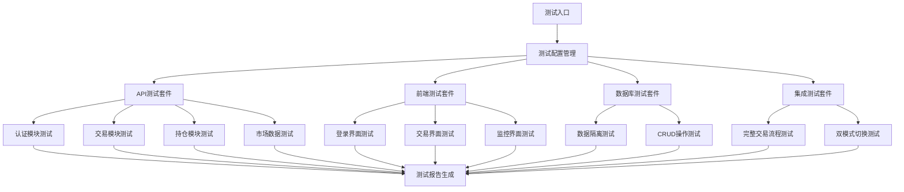
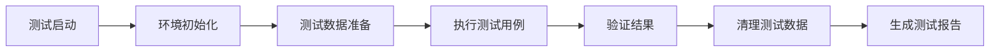

## 产品概述

为美股量化交易系统构建全面的自动化测试套件，确保系统在测试模式和真实模式下的功能稳定性和数据隔离正确性。测试套件将覆盖API接口、前端功能、数据库操作和系统集成等各个层面。

## 核心功能

- API接口自动化测试：覆盖8个主要路由模块的所有端点
- 前端功能自动化测试：使用Selenium验证Web界面交互
- 数据库测试：验证数据隔离、CRUD操作和数据一致性
- 集成测试：端到端业务流程验证
- 双环境测试：测试模式和真实模式的并行验证
- 测试数据管理：自动创建、使用和清理测试数据
- 测试报告生成：详细的测试结果和覆盖率报告

## 技术栈选择

- **测试框架**: pytest + pytest-asyncio（异步测试支持）
- **API测试**: httpx + requests（HTTP客户端）
- **前端测试**: selenium + webdriver-manager（浏览器自动化）
- **数据库测试**: pymysql + pytest-mysql（数据库连接和测试）
- **测试报告**: pytest-html + pytest-cov（HTML报告和覆盖率）
- **测试数据**: factory-boy + faker（测试数据生成）

## 系统架构

### 测试架构设计



### 模块划分

- **测试配置模块**: 管理测试环境配置、数据库连接、测试数据
- **API测试模块**: 针对8个路由模块的接口测试
- **前端测试模块**: Selenium自动化测试Web界面
- **数据库测试模块**: 验证数据操作和隔离机制
- **集成测试模块**: 端到端业务流程测试
- **工具模块**: 测试数据生成、清理、报告生成

### 数据流



## 实现细节

### 核心目录结构

```
tests/
├── conftest.py              # pytest配置和fixtures
├── test_config.py           # 测试配置管理
├── api/                     # API测试
│   ├── test_auth.py         # 认证接口测试
│   ├── test_smart_trade.py  # 智能交易测试
│   ├── test_positions.py    # 持仓管理测试
│   ├── test_market_data.py  # 市场数据测试
│   └── test_longbridge.py   # 长桥SDK测试
├── frontend/                # 前端测试
│   ├── test_login.py        # 登录功能测试
│   ├── test_trading.py      # 交易界面测试
│   └── test_monitoring.py   # 监控界面测试
├── database/                # 数据库测试
│   ├── test_isolation.py    # 数据隔离测试
│   └── test_crud.py         # CRUD操作测试
├── integration/             # 集成测试
│   ├── test_trading_flow.py # 完整交易流程
│   └── test_mode_switch.py  # 模式切换测试
├── fixtures/                # 测试数据和fixtures
│   ├── test_data.py         # 测试数据生成
│   └── db_fixtures.py       # 数据库fixtures
└── utils/                   # 测试工具
    ├── test_helpers.py      # 测试辅助函数
    └── report_generator.py  # 报告生成工具
```

### 关键代码结构

**测试配置类**: 管理测试环境配置，支持测试模式和真实模式的切换，提供数据库连接和API客户端初始化。

```python
class TestConfig:
    def __init__(self, test_mode: bool = True):
        self.test_mode = test_mode
        self.base_url = "http://localhost:8000"
        self.db_config = self._get_db_config()
    
    def get_api_client(self) -> httpx.AsyncClient:
        return httpx.AsyncClient(base_url=self.base_url)
```

**测试数据工厂**: 使用factory-boy生成一致的测试数据，支持不同场景的数据需求。

```python
class TradeFactory(factory.Factory):
    class Meta:
        model = dict
    
    symbol = factory.Faker('random_element', elements=['AAPL', 'GOOGL', 'MSFT'])
    action = factory.Faker('random_element', elements=['BUY', 'SELL'])
    quantity = factory.Faker('random_int', min=1, max=1000)
```

### 技术实现方案

#### API测试策略

1. **端点覆盖**: 测试所有8个路由模块的关键端点
2. **参数验证**: 验证请求参数的有效性和边界条件
3. **响应验证**: 检查响应状态码、数据格式和业务逻辑
4. **错误处理**: 测试异常情况和错误响应
5. **性能测试**: 基本的响应时间和并发测试

#### 前端测试策略

1. **页面加载**: 验证关键页面的正常加载
2. **用户交互**: 模拟用户操作流程
3. **数据展示**: 验证数据的正确显示
4. **表单提交**: 测试表单验证和提交功能
5. **响应式设计**: 测试不同屏幕尺寸的适配

#### 数据库测试策略

1. **数据隔离**: 验证测试模式和真实模式的数据隔离
2. **事务处理**: 测试数据库事务的正确性
3. **数据一致性**: 验证关联数据的一致性
4. **性能测试**: 基本的查询性能测试

### 集成点

- **FastAPI应用**: 通过HTTP客户端与API交互
- **MySQL数据库**: 直接连接验证数据操作
- **长桥SDK**: 模拟SDK调用和响应
- **前端界面**: 通过Selenium WebDriver操作

## 技术考虑

### 测试数据管理

- 使用pytest fixtures管理测试数据生命周期
- 实现测试数据的自动创建和清理
- 支持并行测试的数据隔离

### 性能优化

- 使用异步测试提高执行效率
- 实现测试用例的并行执行
- 优化数据库连接池配置

### 安全措施

- 测试环境与生产环境完全隔离
- 敏感数据的安全处理
- 测试用户权限的严格控制

## 代理扩展

### SubAgent

- **code-explorer**
- 目的: 深入分析现有测试脚本和系统架构，理解当前测试覆盖范围
- 预期结果: 全面了解现有测试基础，识别测试盲点和可复用的测试逻辑